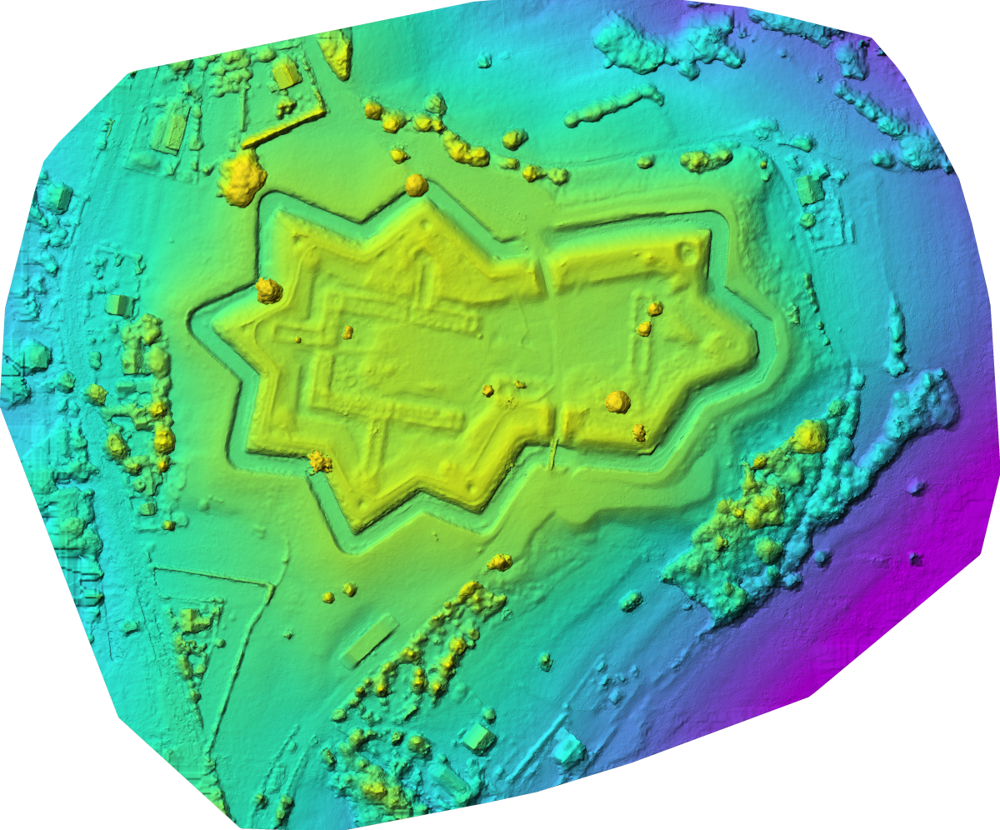

# Jablunkovske sance dataset

Jablunkovske sance photogrammetric dataset 2022. Dataset made with DJI Mavic Mini, from 90m altitude in Jablunkov Pass, on historical site of XVII century fortifications. Flight plan was made with atomicmapper for Litchi.

## Localisation

https://opentopomap.org/#map=16/49.49789/18.74768

## History

In Polish: https://pl.wikipedia.org/wiki/Sza%C5%84ce_jab%C5%82onkowskie
